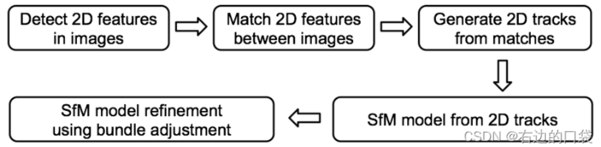

<!-- ## 稀疏重建

structure from motion，sfm

步骤：



https://github.com/jytime/Deep-SfM-Revisited

https://blog.csdn.net/weixin_44292547/article/details/126588237

### 深度学习特征点和描述子

SuperPoint

GCN-SLAM

ZippyPoint

Image Feature Information Extraction for Interest Point Detection: A Review

superpoint + superglue

数据集：https://www.maths.lth.se/matematiklth/personal/calle/dataset/dataset.html

sfm论文：https://demuc.de/papers/schoenberger2016sfm.pdf


https://github.com/cvg/Hierarchical-Localization

### SuGaR question

File "/data/SuGaR-main/sugar_scene/sugar_model.py", line 492, in texture_features
return self.sh_coordinates[self.point_idx_per_pixel]
IndexError: tensors used as indices must be long, byte or bool tensors

```
The problem was resolved by changing self.sh_coordinates[self.point_idx_per_pixel] to self.sh_coordinates[self.point_idx_per_pixel.long()].

In sugar_model.py, self._surface_mesh_faces is also used as indices in 4 lines, for instance in:

faces_verts = self._points[self._surface_mesh_faces]  # n_faces, 3, n_coords
You should replace these with self._surface_mesh_faces.long().
```

how to resume training

```
1. train_coarse_density.py / train_coarse_sdf.py
2. extract_mesh.py
3. train_refined.py (builds the hybrid representation mesh + Gaussians)
4. extract_refined_mesh_with_texture.py
```

## 透视相机和仿射相机

Orthographic Projection 3D Reconstruction

## colmap

```
{'0000.png': 1, '0001.png': 2, '0002.png': 3, '0003.png': 4, '0004.png': 5, '0005.png': 6, '0006.png': 7, '0007.png': 8, '0008.png': 9, '0009.png': 10, '0010.png': 11, '0011.png': 12, '0012.png': 13, '0013.png': 14, '0014.png': 15, '0015.png': 16, '0016.png': 17, '0017.png': 18, '0018.png': 19, '0019.png': 20, '0020.png': 21, '0021.png': 22, '0022.png': 23, '0023.png': 24, '0024.png': 25, '0025.png': 26, '0026.png': 27, '0027.png': 28, '0028.png': 29, '0029.png': 30, '0030.png': 31, '0031.png': 32, '0032.png': 33, '0033.png': 34, '0034.png': 35, '0035.png': 36, '0036.png': 37, '0037.png': 38, '0038.png': 39, '0039.png': 40, '0040.png': 41, '0041.png': 42, '0042.png': 43, '0043.png': 44, '0044.png': 45, '0045.png': 46, '0046.png': 47, '0047.png': 48, '0048.png': 49, '0049.png': 50, '0050.png': 51, '0051.png': 52, '0052.png': 53, '0053.png': 54, '0054.png': 55, '0055.png': 56, '0056.png': 57, '0057.png': 58, '0058.png': 59, '0059.png': 60, '0060.png': 61}
``` -->

## normal prior

surface_normal_uncertainty

what is the normal coordinate

```
Hi, you could apply the loss in the local image coordinate system or in the world coordinate system as long as the rendered normal and monocular normal are in the same coordinate system. The omnidata monocular normal is in the local image coordinate system.
```
The omnidata monocular normal -> local(follow monosdf understanding)

surface_normal_uncertainty -> (do not know, maybe world because it is different to omnidata)

gaussionpro render -> local

```python
normal_img = (np.matmul(rot[None, :, :], normal_img[:, :, None])
                          .reshape([H, W, 3, -1]) * 128 + 128).clip(0, 255)

normal_img_l = (np.matmul(rot.T, normal_img_l.T).T
                          .reshape([H, W, 3, -1]) * 128 + 128).clip(0, 255)

# transform to local coordinate system
rot = pose[0, :3, :3].permute(1, 0).contiguous()
normal_map = rot @ normal_map.permute(1, 0)
normal_map = normal_map.permute(1, 0).contiguous()

# convert normal direction to the camera; calculate the normal in the camera coordinate
view_dir = means3D - viewpoint_camera.camera_center
normal   = normal * ((((view_dir * normal).sum(dim=-1) < 0) * 1 - 0.5) * 2)[...,None]

R_w2c = torch.tensor(viewpoint_camera.R.T).cuda().to(torch.float32)
normal = (R_w2c @ normal.transpose(0, 1)).transpose(0, 1)
```

以上四个是等价的，因此实际上neus，也做了一个change to local coordinate的转换（因为第三段是monosdf的源码里面， 第四段是gaussionpro源码里面）

因此改用omidata monocular normal估计local normal

## edge

Edge-weighted Photometry Regularizing: Pixel difference networks for efficient edge detection

```
python main.py --model pidinet_converted --config carv4 --sa --dil -j 4 --gpu 0 --savedir /path/to/savedir --datadir /path/to/custom_images --dataset Custom --evaluate /path/to/table5_pidinet/save_models/checkpointxxx.pth --evaluate-converted
```

```
python main.py --model pidinet_converted --config carv4 --sa --dil -j 4 --gpu 0 --savedir /mnt/data3/hushuaiwei/3d-reconstruction/data/room0/edges/ --datadir /mnt/data3/hushuaiwei/3d-reconstruction/data/room0/images --dataset Custom --evaluate /mnt/data3/hushuaiwei/3d-reconstruction/pidinet-master/trained_models/table5_pidinet.pth --evaluate-converted
```

$$w_p = 2\phi(e_p)$$ 

## get sfm data

hloc

## pretrain 3dgs

15k steps, GaussianPro provide how to render normal, and provide how to use normal

surface_normal -> [0, 1] -> (x - 0.5) * 2 -> [-1, 1]

3dgs rasterizing -> [-1, 1]


## neus

how to know the scale_mat

```
use iqr to process outlier
use mean as center
```

cv.imread -> bgr, so change to 


## mutual train

## 3dgs output tag

32dcd6e9-a -> no normal or edge

506ed254-4 -> normal and edge (forget change gt_normal from [0, 1] -> [-1, 1])

e0f61216-1 -> normal and edge 

cv.imread -> bgr

PIL -> rgb


